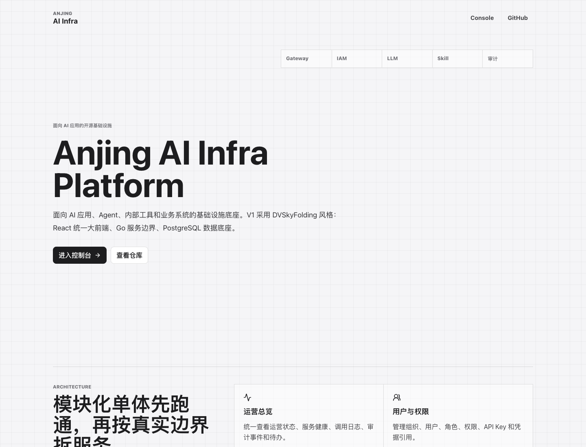
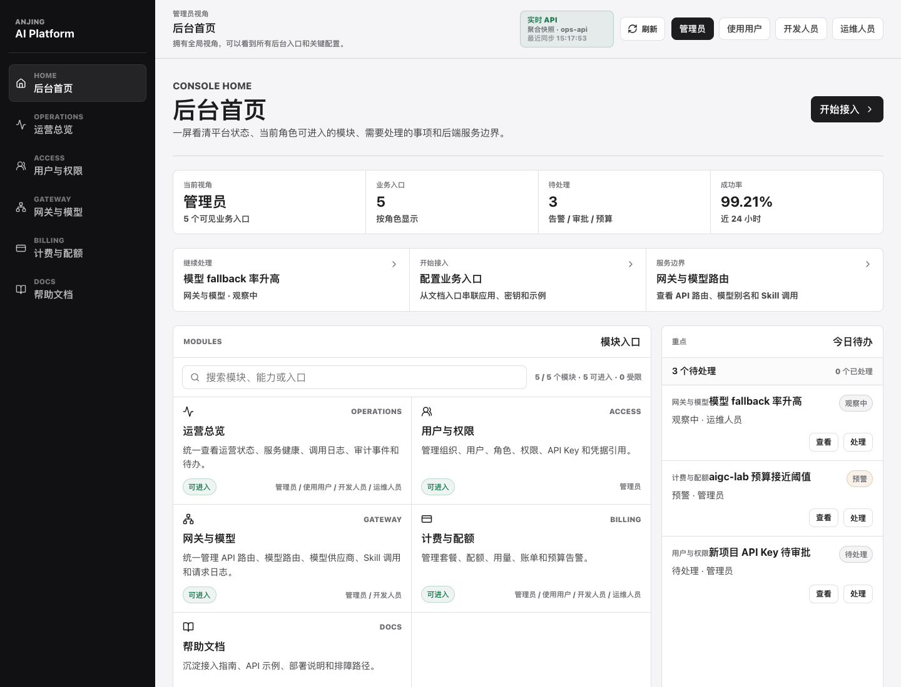
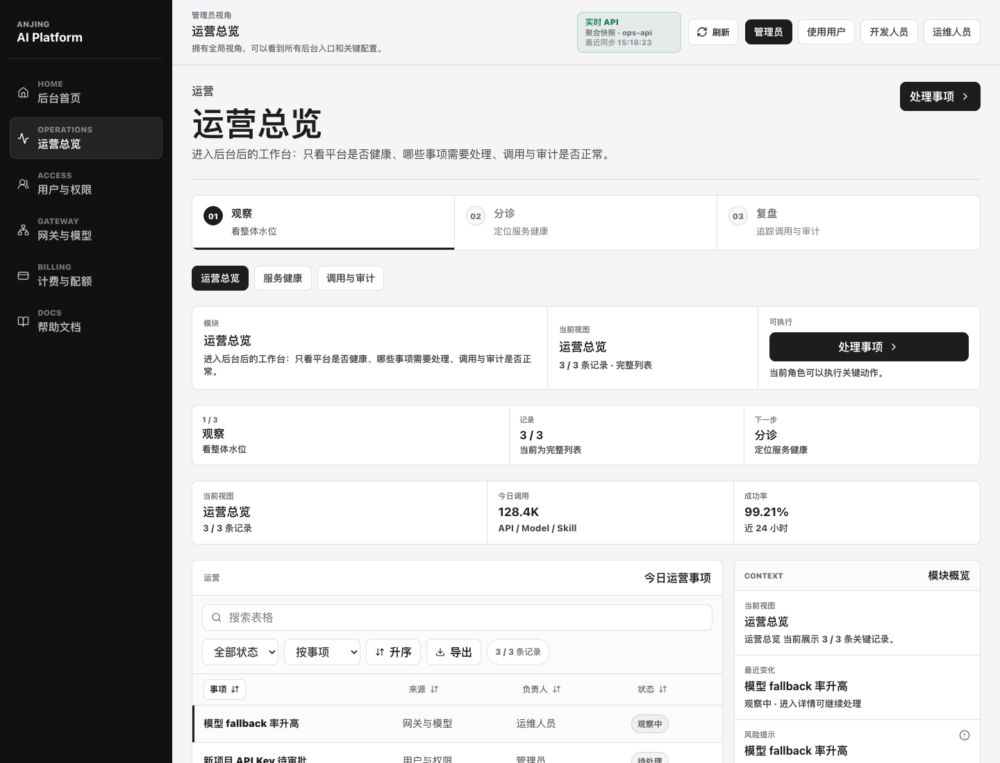
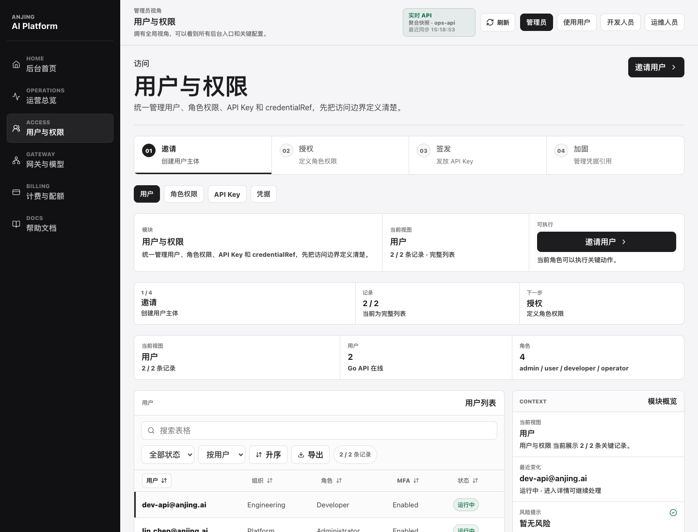
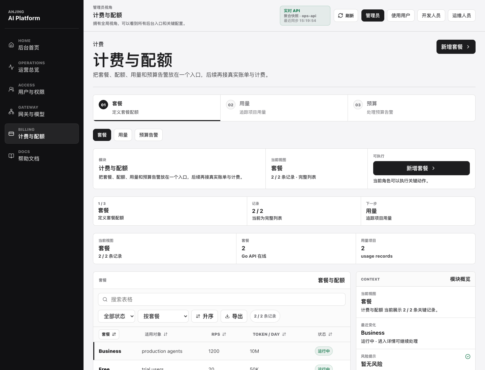
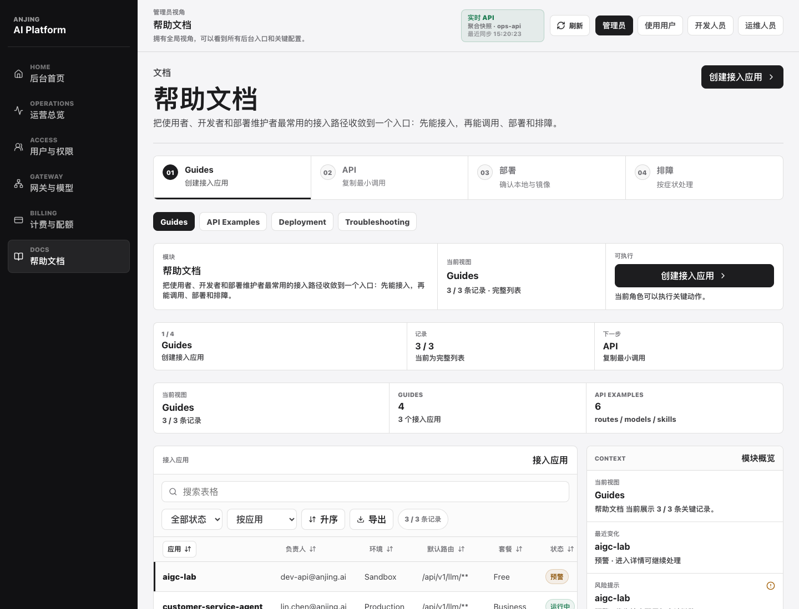
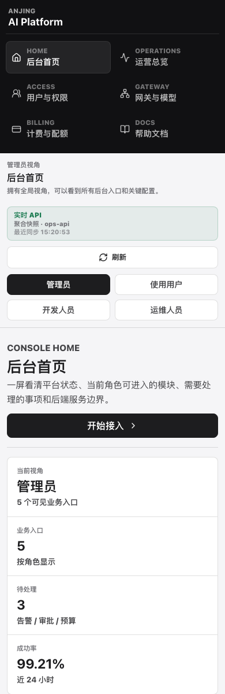
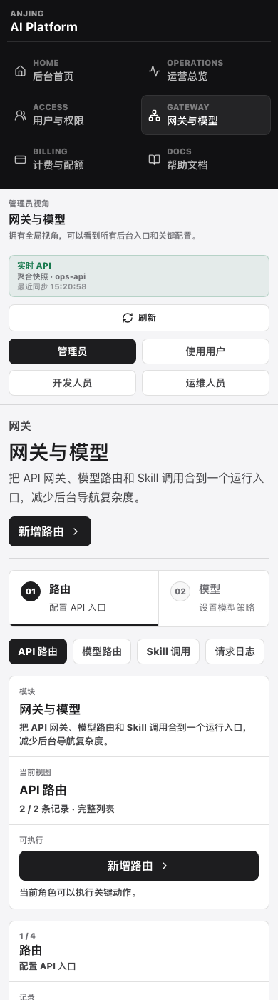
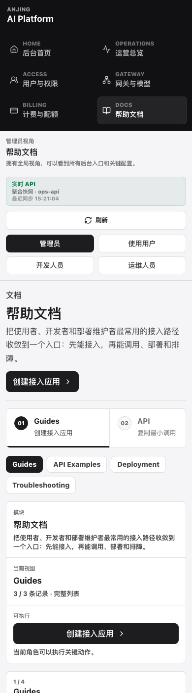

# Console Screenshots

这组截图用于让 public repo 的访问者快速理解当前平台形态：先看到项目定位，再进入后台首页，然后浏览运营、权限、网关、计费和帮助文档五个核心入口。脚本同时保留关键移动端截图，确保窄屏下仍能看清导航、角色视角、模块入口和核心操作。

截图由根目录脚本生成：

```bash
pnpm screenshots:console
```

脚本会先构建 `apps/console`，再临时启动 `cmd/platform-all`，用 Go API 的 seed 数据生成后台截图。生成结束后会自动停止本地服务。

## Landing



## Console Home



## Operations



## Access



## Gateway


## Billing



## Docs



## Mobile Console Home



## Mobile Gateway



## Mobile Docs


